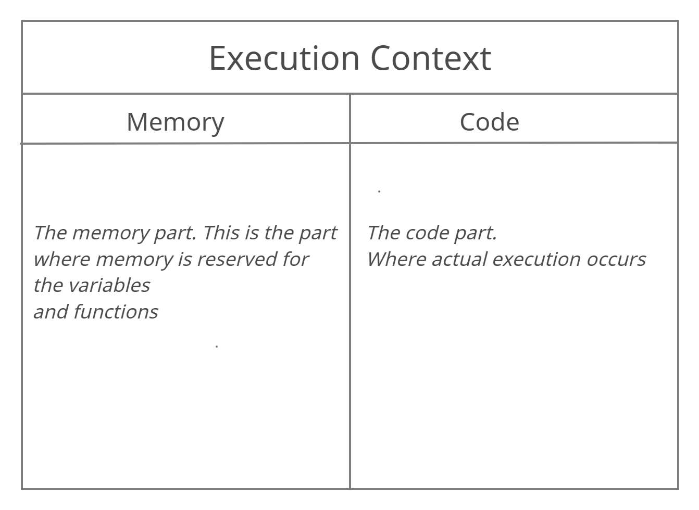

###Introduction
Hi All,this is my 3rd blog.Really enjoying sharing what I learn through
the internet through these blogs.This is technically my first blog where
I am covering a purely technical topic!!

JavaScript is a lightweight, interpreted, programming language with first-class functions.It is most well-known as the scripting language for web pages but
also finds itself in various other domains as well.There are many typical JS concepts and 'Hoisting' is one of them.Here in this blog I have talked about
how JS works in depth and what hoisting exactly is!

###The Execution Context
I am sure many people are not aware of what execution context is.
As a matter of fact,I did'nt know that such a thing existed until
a couple of days back!!

Javascript works very differently than many other programming languages.
In certain aspects it works completely different than any other languages!
The Execution context is the heart of any JS program!! Even before our
program starts it's execution,the execution context gets created in two phases:

-> The Memory Creation Phase
-> Code Execution Phase

Let us see with a visual aid what this means.
<figure>
  
  <figcaption>Javascript Execution Context</figcaption>
</figure>
