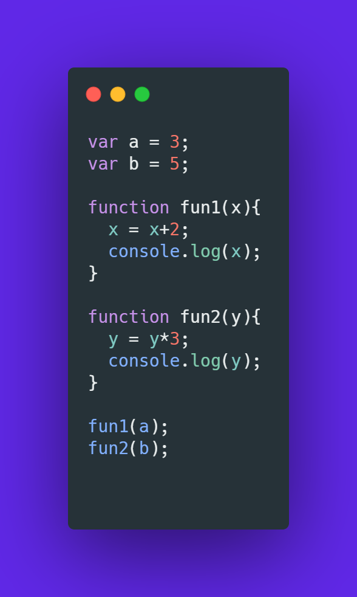
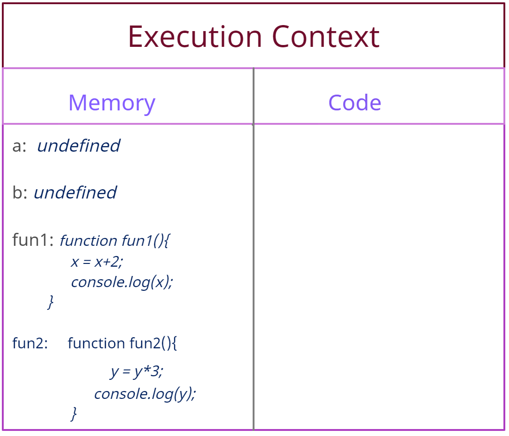
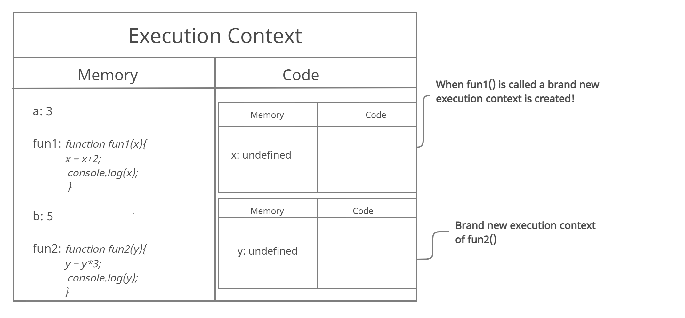
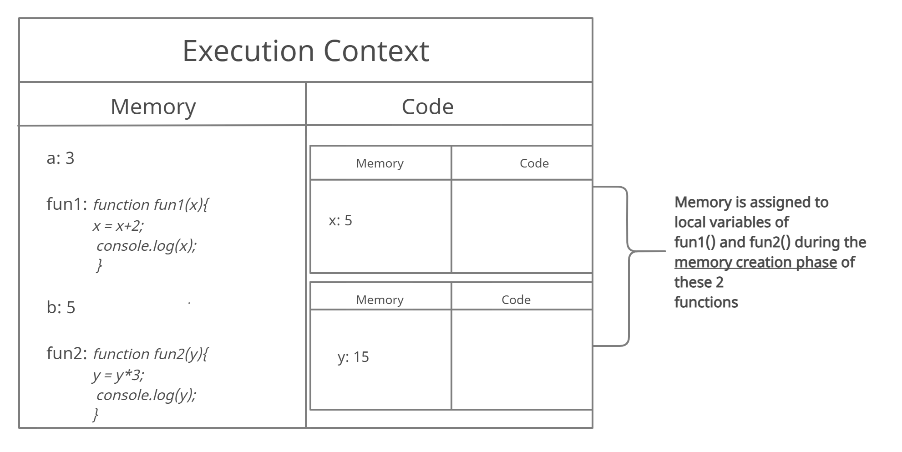
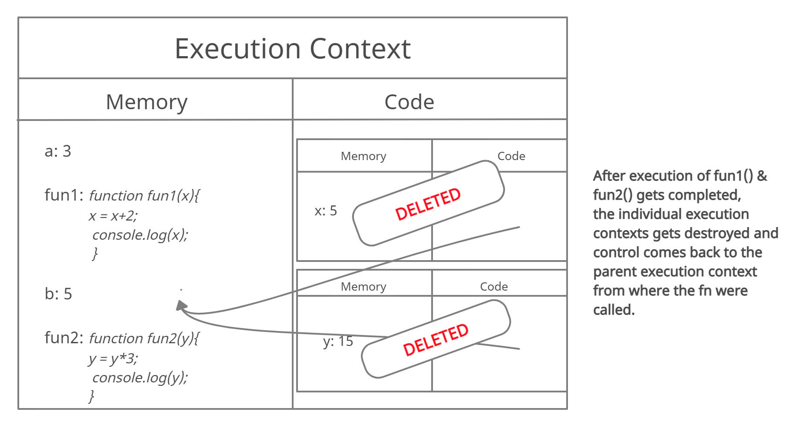
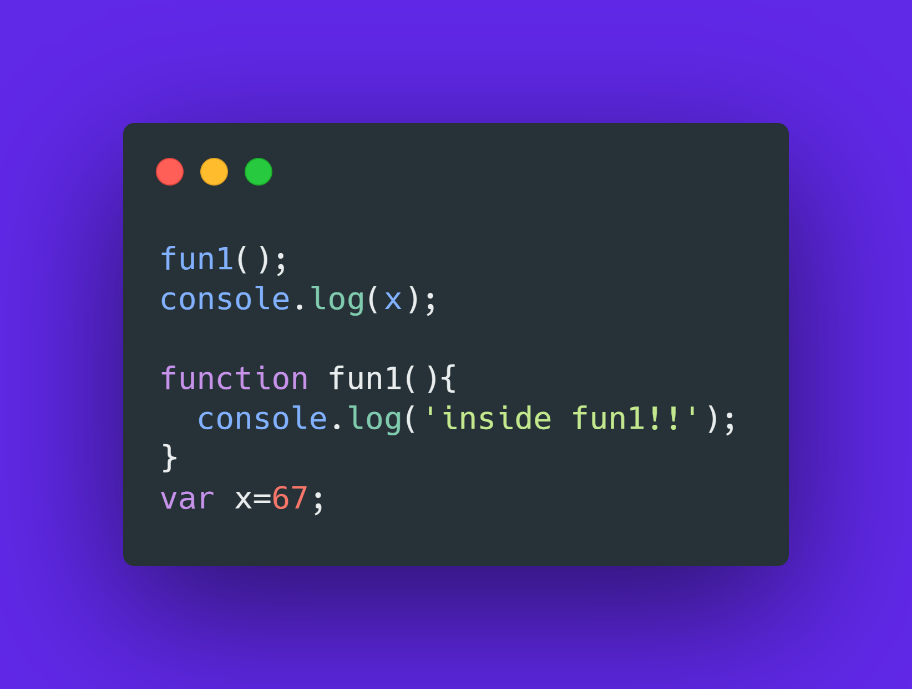
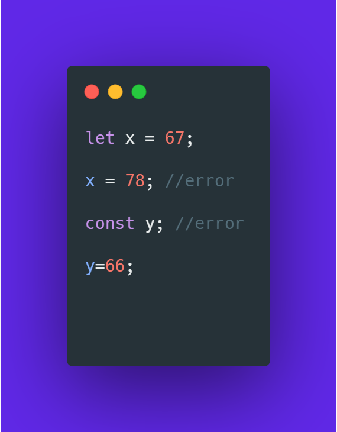
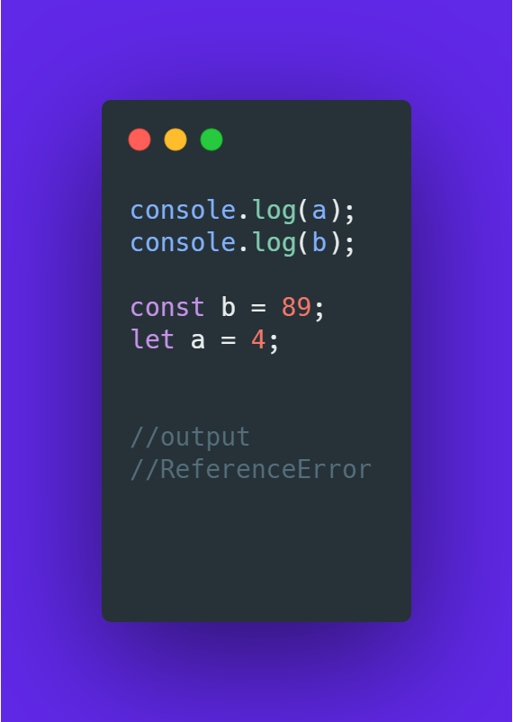

###Introduction
Hi All,this is my 3rd blog.Really enjoying sharing what I learn through
the internet through these blogs.This is technically my first blog where
I am covering a purely technical topic!!

JavaScript is a lightweight, interpreted, programming language with first-class functions.It is most well-known as the scripting language for web pages but
also finds itself in various other domains as well.There are many typical JS concepts and 'Hoisting' is one of them.Here in this blog I have talked about
how JS works in depth and what hoisting exactly is!

###The Execution Context
I am sure many people are not aware of what execution context is.
As a matter of fact,I did'nt know that such a thing existed until
a couple of days back!!

Javascript works very differently than many other programming languages.
In certain aspects it works completely different than any other languages!
The Execution context is the heart of any JS program!! Even before our
program starts it's execution,the execution context gets created in two phases:

-> The Memory Creation Phase
-> Code Execution Phase

Let us see with a visual aid what this means.
<figure>
  
  <figcaption style="text-align:center;">Javascript Execution Context</figcaption>
</figure>

In the memory creation phase,memory is allocated to the variables and functions.
In case of variables 'undefined' is allocated and in case of functions,the whole
function definition itself.Refer to the below code snippet.
<figure>
  
</figure>

What happens even before the above program starts executing?Well this is
the state of the execution context before program execution.
<figure>
  
</figure>

As discussed the variables 'a' and 'b' are assigned 'undefined'(which may be 
regarded as a placeholder) and the 2 functions fun1() and fun2() are assigned
their own function definition only.All this happens in the memory creation phase only.

In the next step,i.e. in code execution phase when fun1() and fun2() gets called,
a brand new execution context gets created in the code area of the global execution context.These two child execution contexts also have the memory and code
phase as shown below.
<figure>
  
</figure>

As in global execution context,here also memory gets allocated for the local variables,parameters belonging to each function.If any nested function is present
then the whole function definition is assigned to that particular function.

Let's see what happens next.This is getting interesting already!

The functions were called with arguments(a & b).So at first 'undefined' was stored
in place of 'x' and 'y',but in the next step the actual value gets allocated as
shown below.
<figure>
  
</figure>

After each function gets executed,the individual child execution contexts
gets destroyed and control comes back to the parent execution context from where
the functions were invoked(the global execution context in this case).

<figure>
  
</figure>

Finally at the very end after program finished execution,the global execution
itself is destroyed and popped out from the call stack.

Eww! Call Stack!? What is that!??

Well,the call stack is where JS stores the different tasks to be performed
in a particular program one after another.For our example program,the call
stack would be something like this:

<figure>
  
  <figcaption>The JS Call Stack</figcaption>
</figure>

At first the global execution context gets pushed into the stack as it is the
starting point of the program.Then execution contexts of fun1() and fun2()
are pushed respectively.

This was all about the execution context.I know it's quite a lot at first
but it is probably the most important concept in JS.

###Hoisting
Now that we have seen what Execution Context is,let's deep dive into
hoisting in JS.There is a common misconception that hoisting means
variables are "hoisted" at the top of the program or something.This is not
true! Nothing gets moved to the top/bottom by JS!! It's all the magic of
execution context!!

<figure>
  
</figure>

Refer to the above code snippet.What do you think will be the output?
.
.
.
Surprise! Surprise! The output is 'inside fun1!!' followed by 'undefined'.
Now why is that you may be wondering,well if you remember the good old
friend execution context,even before the program starts execution, fun1() is assigned the function definition and variable 'x' is assigned 'undefined'.So
when fun1() gets called before initialization,it works perfectly....but
printing 'x' gives 'undefined'.

This is it! yes,this is only hoisting.All you have to understand is the
execution context and that's all!!

Well, you might now say that hoisting does not work on all JS objects.Like,
'let' and 'const' are not hoisted.Well,that is somewhat true and there is
a reason behind that.

Let's see the different type of JS variables!!

###Let vs Var vs Const
As many of us know,there are three types of JS variables(let,var & const).
While 'var' was there from beginning, 'let' and 'const' were introduced few
years back to avoid this issue of hoisting.

var: This is simple.When a variable is declared with keyword 'var',it gets 
      attached to the global scope(the 'window' object).They can be reinitialized
      any no. of times and are hoisted.

let: variables declared with 'let' are a little more strict.Reinitialization of
     these variables are stricly 'NO NO!' and will result in SyntaxError.Also these variables are not attached to the global scope but in a separate
     scope alltogether(also referres to as the 'block scope').

const: This is pretty much similar to 'let' only.Only that,unlike 'let' variables
       which can be initialized later,'const' variables must be initialized at the
       time of declaration only and can't be reinitialized.This is also not present int the global scope but in a different scope like 'let'.

<figure>
  
  <figcaption>let and const variables</figcaption>
</figure>

###Hoisting in 'let' and 'const'
Since 'let' and 'const' are present in a different scope alltogether,hoisting
does not work in a similar way like with 'var' variables.

<figure>
  
</figure>

Why does this happen?Well here also both 'a' and 'b' are assigned 'undefined'
in the execution context.But since both are being accessed before initialization,
they result in ReferenceError.

But with 'var' it was giving 'undefined' right? Not any 'ReferenceError' or anything!

Yes,and that's because for the time between the declaration of 'let' and 'const'
variables till the time the get initialized,they are in so called 'Temporal
Dead Zone' and thus inaccessible.As a result when we try to access these
during temporal dead zone,it results in the famous 'ReferenceError'.

###Conclusion
Wow!! This was heavy!!😅 haha!! I hope this was useful to some extent.When I
first learnt 'hoisting' I learned it in a very wrong way and I don't want
anyone to face the same! Just remember nothing gets hoisted to the top or anywhere!! It is just the execution context.

Hope you liked this.In my next blog I will try to vover another important
concept in JS.Until then goodbye and thank you for taking the time to read!😊